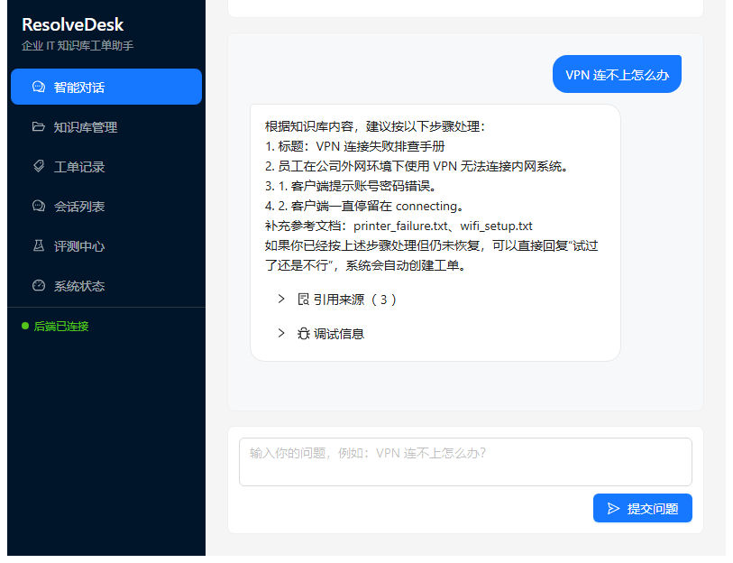
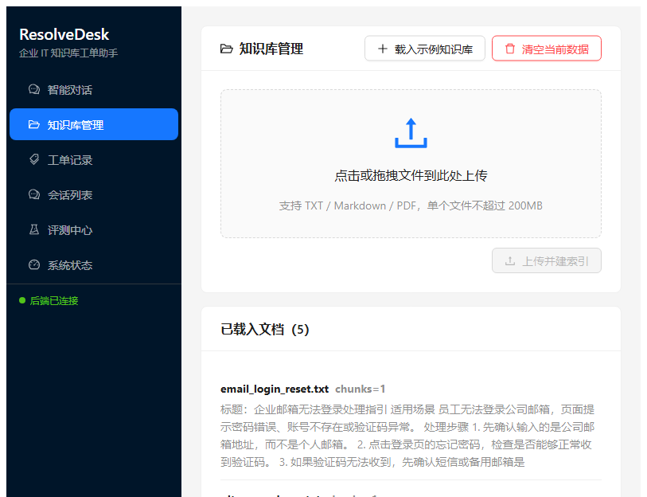
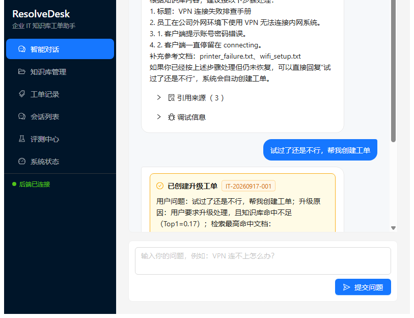
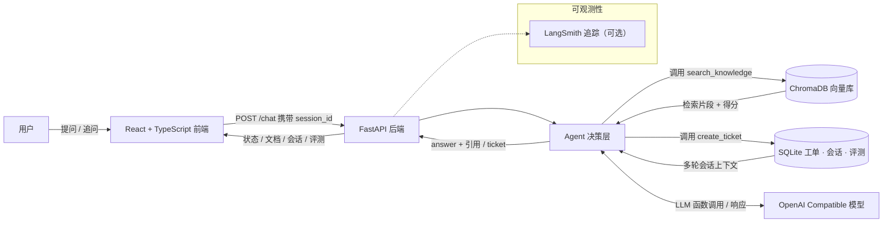

# ResolveDesk

[](https://github.com/H-F-F/ResolveDesk/actions/workflows/ci.yml)
[](https://github.com/H-F-F/ResolveDesk)
[](https://github.com/H-F-F/ResolveDesk)
[](LICENSE)

企业 IT 知识库工单助手：RAG 检索 + Tool Calling Agent 自主决策 + 多轮会话 + 可观测性。

用户提问后，Agent 先检索企业知识库；命中则给出带引用来源的解答，查不到或用户反馈"还是不行"则自动创建工单转交技术人员。支持离线模式，无需任何 API Key 即可本地运行演示。

## 功能特性

- RAG 问答：文档导入（TXT / MD / PDF）→ 分块 → 向量化 → 混合检索排序，回答带引用片段与得分
- Tool Calling Agent：`search_knowledge` / `create_ticket` 工具循环，LLM 自主决策；无模型时回退启发式规则
- 多轮会话：`session_id` 贯穿请求，SQLite 持久化会话与消息，Agent 自动携带上下文理解追问
- 内置评测套件：一键运行命中回答 / 未命中转单 / 显式升级等用例
- 可观测性：响应携带决策路径、工具调用序列与检索分数，预留 LangSmith 追踪

## 界面预览



| 知识库管理 | 多轮会话与工单创建 |
| --- | --- |
|  |  |

## 系统架构



## 核心流程

1. 文档被读取、切分为文本块并写入 ChromaDB 向量库
2. 用户提问后，Agent 通过工具调用检索知识库（`search_knowledge`）
3. 如果结果足够可信，Agent 基于检索片段生成带引用的回答
4. 如果结果不足、前序方案无效，或用户明确要求升级，Agent 调用 `create_ticket` 创建工单

### 两种决策路径

| 模式 | 触发条件 | 行为 |
| --- | --- | --- |
| Tool Calling Agent | 配置真实模型（`CHAT_PROVIDER=openai_compatible`） | LLM 通过函数调用自主决定"检索 / 回答 / 转单"，支持多轮上下文 |
| 启发式回退 | 离线模式（`CHAT_PROVIDER=offline`） | 混合分数 + 阈值 + 升级关键词规则决策，零外部依赖 |

两种路径均支持多轮会话与工单记录。

## 技术栈

| 层 | 选型 |
| --- | --- |
| 前端 | React 18 + TypeScript（strict）· Vite · Ant Design 5 · TanStack Query · React Router · axios |
| 后端 | FastAPI · Python 3.12 / 3.13 · pydantic v2 |
| 数据 | ChromaDB（向量检索）· SQLite（工单 / 会话 / 评测）· 混合检索（向量 + 词法） |
| 模型 | OpenAI Compatible 接口（如阿里云百炼）· 离线模式零依赖 |
| 工程 | ESLint + Prettier · Vitest · ruff · GitHub Actions |

## 目录结构

```text
backend/                    FastAPI 后端
  app/
    main.py                 应用入口与路由
    config.py               配置定义（含嵌入维度自动探测）
    database.py             SQLite 初始化与访问（工单/评测/会话）
    schemas.py              API 数据模型
    services/
      agent.py              Tool Calling Agent 与启发式回退
      conversations.py      会话与消息持久化
      vector_store.py       ChromaDB 向量库（含维度一致性校验）
      responder.py          LLM 客户端与回答/摘要生成
      evaluator.py          内置评测套件
      ...

frontend/                   React + TypeScript 前端（Vite）
  src/
    api/                    API 类型定义与 axios 客户端（与后端 schemas 对齐）
    pages/                  对话 / 知识库 / 工单 / 会话 / 评测 / 状态
    components/layout/      应用布局与侧边导航
  vite.config.ts            开发代理（/api → 后端）与构建配置

data/
  knowledge_base/           内置样例知识库
  upload_test_docs/         上传测试文件

deploy/
  backend.Dockerfile        后端容器构建
  frontend.Dockerfile       前端多阶段构建（Node 编译 → nginx 托管）
  nginx/default.conf        nginx 静态托管 + /api 反向代理
  healthcheck_http.py       容器健康检查

tests/                      自动化测试与手动测试说明
.github/workflows/ci.yml    GitHub Actions：lint + 测试
```

## 运行要求

- Python 3.11+（推荐 3.12 / 3.13，与 CI 一致）
- Node.js 18+（推荐 22 LTS，与 CI 一致）
- 如需解析 PDF，需要 `pymupdf`（requirements 已包含）
- 如需接入外部模型，需要一个 OpenAI Compatible 接口

## 快速开始

```powershell
# 1. 创建后端虚拟环境并安装依赖
python -m venv .venv
.venv\Scripts\Activate.ps1
pip install -r requirements.txt

# 2. 安装前端依赖
cd frontend
npm install
cd ..

# 3. 配置环境变量（可选，默认离线模式可直接运行）
copy .env.example .env
# 编辑 .env，填入模型配置

# 4. 一键启动（后端 + 前端）
./run.ps1
```

也可以分别启动：

```powershell
python -m uvicorn backend.app.main:app --host 127.0.0.1 --port 8000
cd frontend
npm run dev        # 开发服务器，/api 自动代理到 8000
```

默认访问地址：

- 前端页面：`http://127.0.0.1:5173`
- 后端 API：`http://127.0.0.1:8000`（交互文档 `/docs`）

## Docker 启动

```bash
# 开发环境（前端容器含 nginx 静态托管 + /api 反向代理）
docker compose up --build

# 生产环境
docker compose -f docker-compose.prod.yml up --build -d
```

前端镜像采用多阶段构建：`node:22-alpine` 编译 React 产物 → `nginx:alpine` 托管静态文件；`/api/*` 由 nginx 转发到后端，`/` 提供前端页面。开发环境前端入口 `http://localhost:8501/`，生产环境 `http://localhost/`。

## 配置说明

项目启动时自动读取根目录下的 `.env` 和 `.env.local`（不存在则使用默认值）。完整模板见 `.env.example`。

| 变量 | 说明 | 默认值 |
| --- | --- | --- |
| `APP_NAME` | 应用名 | `IT Knowledge Ticket Assistant` |
| `APP_ENV` | 运行环境 | `local` |
| `CHAT_PROVIDER` | 聊天模型提供方 | `offline` |
| `EMBEDDING_PROVIDER` | 向量模型提供方 | `offline` |
| `MODEL_API_BASE` | OpenAI Compatible API 基地址 | 空 |
| `MODEL_API_KEY` | 模型 API Key | 空 |
| `CHAT_MODEL_NAME` | 聊天模型名 | 空 |
| `EMBEDDING_MODEL_NAME` | 向量模型名 | 空 |
| `CHROMA_COLLECTION` | Chroma 集合名前缀 | `it_knowledge_base` |
| `RAG_TOP_K` | 检索返回数量 | `3` |
| `RAG_SCORE_THRESHOLD` | 综合分数阈值（离线模式） | `0.22` |
| `RAG_LEXICAL_SCORE_THRESHOLD` | 词法分数阈值（离线模式） | `0.2` |
| `CHUNK_SIZE` / `CHUNK_OVERLAP` | 文本分块大小 / 重叠 | `700` / `120` |
| `EMBEDDING_DIMENSION` | 离线向量维度 | `1536` |
| `LANGSMITH_TRACING` | 是否启用 LangSmith 追踪 | 关 |

> 使用真实嵌入模型时，系统启动时会自动探测模型实际输出维度并用于集合命名（集合名格式 `{collection}_{维度}`），无需手动调整 `EMBEDDING_DIMENSION`；如果既有向量库维度与当前模型不一致，会给出明确报错，调用 `POST /reset` 或删除 `storage/` 后重新导入即可。

## API 概览

### 健康与状态

- `GET /health`
- `GET /status`：环境、文档数、工单数、会话数、评测记录数、模型提供方、PDF 支持

### 知识库

- `GET /documents`
- `POST /ingest`（`multipart/form-data`，字段名 `files`）
- `POST /ingest/samples`

### 对话与工单

- `POST /chat`：可选传入 `session_id` 实现多轮对话，响应返回 `session_id`
- `GET /tickets`
- `GET /sessions`：会话列表（消息数、更新时间）

```json
// 请求（新会话）
{ "message": "VPN 连不上怎么办？" }

// 请求（继续会话）
{ "message": "还是不行", "session_id": "abc123" }
```

响应有两种模式：

- `mode=answer`：返回答案与引用片段
- `mode=ticket`：返回创建的工单与转单原因

### 评测

- `POST /evaluate/samples`：运行内置 6 条评测用例（命中回答 / 未命中转单 / 显式升级）
- `GET /evaluations`、`GET /evaluations/{run_id}`：评测历史与明细

### 重置

- `POST /reset?load_samples=true&clear_evaluations=true`：清空向量库、工单、会话与可选评测历史，并可重新导入样例

## 前端功能

- 智能对话：多轮会话（会话消息本地持久化，切换页面不丢失）、引用来源、调试信息（决策路径 / 工具调用）、新会话
- 知识库管理：拖拽上传（TXT / MD / PDF）、导入样例、文档列表与摘要、一键清空
- 工单记录 / 会话列表：完整展示工单与会话信息
- 评测中心：一键运行内置评测、历史批次与用例明细回看
- 系统状态：模型提供方、数据量统计、PDF 支持，自动刷新

## 数据存储

默认写入 `storage/`（已在 .gitignore 中排除）：

- `storage/app.db`：工单、评测历史、会话与消息
- `storage/chroma/`：向量索引
- `storage/logs/app.log`：运行日志

## 测试与代码规范

```powershell
# 后端单元测试（22 条用例，覆盖 Agent 工具循环、会话记忆、API 全链路）
python -m unittest discover -s tests -p "test_*.py"
pip install ruff
ruff check .

# 前端（TypeScript 检查 + 组件测试 + lint）
cd frontend
npm run build      # tsc -b && vite build
npm run test       # Vitest 组件测试
npm run lint       # ESLint
```

CI（GitHub Actions）在每次 push 时自动运行：

- 后端：ruff + 22 条单元测试（Python 3.12 / 3.13 矩阵）
- 前端：ESLint + 类型检查 + 构建 + Vitest（Node 22）

手动测试说明见 `tests/manual_test_cases.md`。

## 已知实现边界

- 检索采用 ChromaDB 向量 + 本地词法覆盖率混合排序，分数可解释、可调试
- 真实模型模式下走 Tool Calling Agent 循环，离线模式自动回退到规则决策，保证任何环境可演示
- 工单为本地模拟，不对接真实 ITSM 系统
- 文档按文本块处理，不包含复杂权限、租户和审批流程

## License

[MIT](LICENSE)
